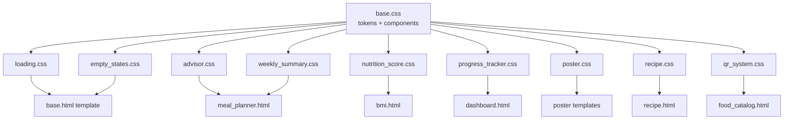

# Design Document — SaaS UI Redesign
## NutriPrint V2 · Frontend Visual Overhaul

---

## Overview

This document describes the complete technical design for the `saas-ui-redesign` feature — a **frontend-only** visual overhaul of NutriPrint V2. No Python code, API routes, database schemas, or Pydantic models are changed. All changes are confined to:

- A new `/static/css/base.css` (design token definitions, `.shell-card`, `.badge`)
- Existing `/static/css/*.css` files (updated to reference tokens, visual upgrades)
- Jinja2 templates in `/templates/` (HTML class additions, layout improvements)

The redesign targets a **modern SaaS dashboard aesthetic** consistent with products like Linear, Vercel, or Notion — dark navy primary, emerald accent, frosted glass navigation, clean card-based layouts.

### Key Design Goals

1. Introduce a single source of truth for all design tokens via CSS custom properties.
2. Unify the `Shell_Card` and `Badge` components across all six pages.
3. Upgrade the navigation, hero section, and each page to startup-grade visual quality.
4. Preserve 100% of existing JS selectors, form attributes, and API contracts.
5. Ship a fully responsive layout that works from 320 px wide up to 1440 px+ wide.

---

## Architecture

### CSS Layer Structure

```
/static/css/
├── base.css              ← NEW: :root tokens, .shell-card, .badge, global resets
├── loading.css           ← existing (minor token references added)
├── empty_states.css      ← existing (minor token references added)
├── nutrition_score.css   ← existing (minor token references added)
├── poster.css            ← existing (minor token references added)
├── progress_tracker.css  ← existing (minor token references added)
├── qr_system.css         ← existing (minor token references added)
├── recipe.css            ← existing (minor token references added)
├── weekly_summary.css    ← existing (minor token references added)
└── advisor.css           ← existing (minor token references added)
```

### Load Order in `base.html`

`base.css` is loaded **first**, before all other stylesheets, so that every subsequent file can reference `:root` custom properties without forward-declaration concerns.

```html
<!-- base.html <head> — NEW first entry -->
<link rel="stylesheet" href="/static/css/base.css"/>
<!-- existing entries follow -->
<link rel="stylesheet" href="/static/css/loading.css"/>
<link rel="stylesheet" href="/static/css/empty_states.css"/>
```

### Tailwind Relationship

The project currently loads Tailwind CDN. The redesign does **not** remove Tailwind — it layers on top. Brand-specific design tokens and component classes (`.shell-card`, `.badge`, `.nav-link`, etc.) are defined in `base.css` and take precedence over Tailwind utilities via specificity and load order.

### Page-Specific Styles

Page-specific `<style>` blocks remain inside their respective Jinja2 templates (as they do today). They are only permitted to:
- Define page-unique layout helpers (e.g., `.day-card-grid`).
- Override token-derived values only when semantically justified (e.g., a print stylesheet).
- Never override `.shell-card` border-radius, box-shadow, or background.

### Mermaid Architecture Diagram



---

## Components and Interfaces

### 2.1 Design Token System (`base.css` `:root` block)

```css
:root {
  /* ── Brand Colours ─────────────────────── */
  --color-primary:      #0F172A;   /* dark navy */
  --color-accent:       #10B981;   /* emerald green */
  --color-bg:           #F8FAFC;   /* page background */
  --color-surface:      #FFFFFF;   /* card surface */
  --color-text:         #0F172A;   /* primary text */
  --color-text-muted:   #64748B;   /* secondary text */

  /* ── Derived Accent Tints ──────────────── */
  --color-accent-light: rgba(16,185,129,0.10);
  --color-accent-mid:   rgba(16,185,129,0.20);
  --color-accent-dark:  #0D9668;

  /* ── Semantic Colours ──────────────────── */
  --color-error:        #EF4444;
  --color-warning:      #F59E0B;
  --color-success:      #10B981;   /* same as accent */
  --color-info:         #3B82F6;

  /* ── Shadows ───────────────────────────── */
  --shadow-card:   0 14px 35px rgba(15,23,42,0.06);
  --shadow-hover:  0 22px 48px rgba(15,23,42,0.10);
  --shadow-nav:    0 1px 0 rgba(15,23,42,0.04);

  /* ── Radii ─────────────────────────────── */
  --radius-card:   1.5rem;
  --radius-inner:  1rem;
  --radius-pill:   9999px;

  /* ── Spacing scale (4 px base grid) ────── */
  --space-1:  0.25rem;
  --space-2:  0.5rem;
  --space-3:  0.75rem;
  --space-4:  1rem;
  --space-5:  1.25rem;
  --space-6:  1.5rem;
  --space-7:  1.75rem;
  --space-8:  2rem;
  --space-10: 2.5rem;
  --space-16: 4rem;
  --space-20: 5rem;

  /* ── Typography ────────────────────────── */
  --font-heading: 'Poppins', sans-serif;
  --font-body:    'Inter', sans-serif;
}
```

### 2.2 Shell_Card Component

Defined once in `base.css`. No page-level stylesheet may redefine these four canonical properties on a `.shell-card` element.

```css
.shell-card {
  background:    var(--color-surface);
  border:        1px solid rgba(148,163,184,0.18);
  border-radius: var(--radius-card);
  box-shadow:    var(--shadow-card);
}
```

**Usage pattern** — existing `<div class="soft-card">`, `.advisor-shell`, `.ns-card`, `.wns-panel`, `.es-card` are either replaced by adding `.shell-card` to their class list (where it's safe to add a class without breaking JS) or their CSS rules are updated to reference the tokens instead of hard-coded values.

**JS Safety Rule**: The class is *added* alongside existing classes, never replacing them. For example:
```html
<!-- Before -->
<div class="advisor-shell">
<!-- After (safe — advisor-shell still exists for JS) -->
<div class="advisor-shell shell-card">
```

### 2.3 Badge / Pill Component

```css
/* base.css — canonical badge */
.badge {
  display:        inline-flex;
  align-items:    center;
  gap:            0.25rem;
  padding:        0.25rem 0.75rem;
  border-radius:  var(--radius-pill);   /* 9999px */
  font-size:      0.75rem;
  font-weight:    700;                  /* ≥ 600 */
  line-height:    1.4;
  white-space:    nowrap;
}

/* Semantic colour variants */
.badge--green   { background: #D1FAE5; color: #065F46; }
.badge--blue    { background: #DBEAFE; color: #1D4ED8; }
.badge--orange  { background: #FEF3C7; color: #92400E; }
.badge--red     { background: #FEE2E2; color: #991B1B; }
.badge--accent  { background: var(--color-accent); color: #FFFFFF; }
.badge--outline {
  background: transparent;
  border: 1.5px solid var(--color-accent);
  color: var(--color-accent);
}

/* BMI classification aliases (existing class names preserved) */
.badge-underweight { background: #DBEAFE; color: #1D4ED8; }
.badge-normal      { background: #D1FAE5; color: #065F46; }
.badge-overweight  { background: #FEF3C7; color: #92400E; }
.badge-obese       { background: #FEE2E2; color: #991B1B; }
```

> **Note**: Existing `.badge-*` class names (already defined in `base.html` inline styles) are **kept** as aliases in `base.css` rather than renamed — preserving any JS or template references.

---

## Data Models

This feature has no new data models. It is purely presentational.

The only data-touching concern is ensuring the impact stats panel correctly reads the response from `GET /api/impact`:

```json
{
  "total_plans": 1247,
  "total_students": 583,
  "total_foods": 53
}
```

These three numeric values are mapped to the three hero stat counter elements. The field names `total_plans`, `total_students`, `total_foods` must not be changed — they originate from `routers/foods.py::impact()`.

---

## Page-Level Design Specifications

### 3.1 Navigation (`base.html`)

**Frosted-Glass Header**

The existing `<header>` already uses `backdrop-filter: blur(xl)` via Tailwind. The redesign strengthens this with an explicit CSS class and scroll-based JS enhancement:

```css
/* base.css */
.site-header {
  position:   sticky;
  top:        0;
  z-index:    50;
  background: rgba(255,255,255,0.92);
  backdrop-filter: blur(20px);
  -webkit-backdrop-filter: blur(20px);
  border-bottom: 1px solid rgba(148,163,184,0.12);
  box-shadow: var(--shadow-nav);
  transition: box-shadow 200ms ease, background 200ms ease;
}

.site-header.scrolled {
  box-shadow: 0 4px 24px rgba(15,23,42,0.08);
  background: rgba(255,255,255,0.97);
}
```

A tiny JS scroll listener (added to `base.html`, no external file) toggles `.scrolled`:

```html
<script>
  window.addEventListener('scroll', () => {
    document.querySelector('.site-header')
      ?.classList.toggle('scrolled', window.scrollY > 10);
  }, { passive: true });
</script>
```

**Active Nav State** — the existing `.nav-link-active` class is preserved and updated to use the accent token:

```css
.nav-link-active {
  color:      var(--color-accent);
  background: var(--color-accent-light);
  box-shadow: inset 0 0 0 1.5px var(--color-accent-mid);
}
```

**Mobile Drawer** — the existing `#mobileNav` / `toggleMobileNav()` mechanism is preserved. CSS is updated to provide a smooth slide-down animation:

```css
#mobileNav {
  max-height: 0;
  overflow:   hidden;
  transition: max-height 280ms cubic-bezier(0.4,0,0.2,1);
}

#mobileNav.open {
  max-height: 400px;
}
```

The existing `toggleMobileNav()` function in `base.html` is updated to toggle the `.open` class instead of `hidden`:

```js
function toggleMobileNav() {
  const nav = document.getElementById('mobileNav');
  if (!nav) return;
  const isOpen = nav.classList.toggle('open');
  // close on outside click
  if (isOpen) {
    setTimeout(() => {
      document.addEventListener('click', function handler(e) {
        if (!nav.contains(e.target) && !e.target.closest('[aria-label="Open menu"]')) {
          nav.classList.remove('open');
          document.removeEventListener('click', handler);
        }
      });
    }, 0);
  }
}
```

> **JS Safety**: `toggleMobileNav` is defined in `base.html` already and called via `onclick`. The redesign updates the inline definition only. The `id="mobileNav"` is preserved.

**Layout** — desktop nav (≥ 1024 px): single horizontal row, `flex-wrap: nowrap`.

### 3.2 Homepage Hero Section (`index.html`)

**Layout** — two-column grid on desktop (copy left, impact panel right), single column on mobile:

```css
.hero-grid {
  display: grid;
  gap: var(--space-8);
  align-items: center;
}

@media (min-width: 1024px) {
  .hero-grid {
    grid-template-columns: 1.1fr 0.9fr;
  }
}
```

**Gradient Banner** — full-width, min-height 420px on desktop:

```css
.hero-banner {
  background:    linear-gradient(135deg, var(--color-primary) 0%, var(--color-accent) 100%);
  min-height:    420px;
  border-radius: var(--radius-card);
  overflow:      hidden;
  position:      relative;
  padding:       3rem 2rem;
}

@media (max-width: 1023px) {
  .hero-banner { min-height: auto; padding: 2.5rem 1.5rem; }
}
```

**Gradient Text Headline** — CSS gradient clip on a `<span>` inside the H1:

```css
.hero-headline-accent {
  background: linear-gradient(90deg, #6EE7B7 0%, var(--color-accent) 50%, #34D399 100%);
  -webkit-background-clip: text;
  -webkit-text-fill-color: transparent;
  background-clip: text;
}
```

**CTA Buttons**:

```css
.btn-hero-primary {
  background:    var(--color-surface);
  color:         var(--color-primary);
  padding:       0.875rem 1.75rem;
  border-radius: var(--radius-pill);
  font-weight:   700;
  font-size:     1rem;
  box-shadow:    0 8px 24px rgba(255,255,255,0.2);
  transition:    transform 160ms ease, box-shadow 160ms ease;
}
.btn-hero-primary:hover { transform: translateY(-2px); box-shadow: 0 14px 32px rgba(255,255,255,0.28); }

.btn-hero-secondary {
  background:    var(--color-accent);
  color:         #FFFFFF;
  padding:       0.875rem 1.75rem;
  border-radius: var(--radius-pill);
  font-weight:   700;
  font-size:     1rem;
  border:        2px solid rgba(255,255,255,0.25);
  transition:    transform 160ms ease, background 160ms ease;
}
.btn-hero-secondary:hover { transform: translateY(-2px); background: var(--color-accent-dark); }
```

**Staggered Fade-Up Animation** — each hero child element gets an `animation-delay` using CSS custom property:

```css
.hero-animate {
  opacity:   0;
  animation: heroFadeUp 400ms ease forwards;
}
@keyframes heroFadeUp {
  from { opacity: 0; transform: translateY(16px); }
  to   { opacity: 1; transform: translateY(0); }
}
.hero-animate:nth-child(1) { animation-delay: 0ms;   }
.hero-animate:nth-child(2) { animation-delay: 100ms; }
.hero-animate:nth-child(3) { animation-delay: 200ms; }
.hero-animate:nth-child(4) { animation-delay: 300ms; }
/* Total: 300ms delay + 400ms duration = 700ms > 600ms.
   To comply with ≤ 600ms total, use delay + duration ≤ 600ms: */
.hero-animate:nth-child(4) { animation-delay: 200ms; } /* 200 + 400 = 600ms ✓ */
```

**Impact Stats Panel** — right column, fetches `/api/impact` on load:

```html
<div id="heroImpactPanel" class="shell-card hero-impact-panel">
  <div class="hero-stat-row">
    <span class="hero-stat-num" id="stat-plans">—</span>
    <span class="hero-stat-label">Meal Plans Generated</span>
  </div>
  <div class="hero-stat-row">
    <span class="hero-stat-num" id="stat-students">—</span>
    <span class="hero-stat-label">Students Assessed</span>
  </div>
  <div class="hero-stat-row">
    <span class="hero-stat-num" id="stat-foods">—</span>
    <span class="hero-stat-label">Karnataka Foods</span>
  </div>
</div>
```

```js
// Inline in index.html — fetches /api/impact
fetch('/api/impact')
  .then(r => r.json())
  .then(d => {
    animateCounter('stat-plans',    d.total_plans    ?? 0);
    animateCounter('stat-students', d.total_students ?? 0);
    animateCounter('stat-foods',    d.total_foods    ?? 0);
  })
  .catch(() => {});
```

### 3.3 Statistics Cards (Homepage)

```css
/* base.css */
.stats-grid {
  display: grid;
  grid-template-columns: repeat(2, 1fr);
  gap: var(--space-5);
}

@media (min-width: 640px) {
  .stats-grid { grid-template-columns: repeat(4, 1fr); }
}

.stat-card {
  /* Extends shell-card */
  background:    var(--color-surface);
  border:        1px solid rgba(148,163,184,0.18);
  border-radius: var(--radius-card);
  box-shadow:    var(--shadow-card);
  padding:       var(--space-5);
  display:       flex;
  flex-direction: column;
  align-items:   center;
  gap:           var(--space-3);
  text-align:    center;
  position:      relative;
  overflow:      hidden;
  transition:    transform 160ms ease, box-shadow 160ms ease;
}

.stat-card::after {
  content:       '';
  position:      absolute;
  bottom:        0;
  left:          0;
  right:         0;
  height:        3px;
  background:    var(--color-accent);
  transform:     scaleX(0);
  transition:    transform 200ms ease;
  border-radius: 0 0 var(--radius-card) var(--radius-card);
}

.stat-card:hover {
  transform:  translateY(-4px);
  box-shadow: var(--shadow-hover);
}

.stat-card:hover::after {
  transform: scaleX(1);
}

.stat-card-icon {
  width:         3rem;
  height:        3rem;
  border-radius: var(--radius-inner);
  background:    var(--color-accent-light);
  display:       flex;
  align-items:   center;
  justify-content: center;
  font-size:     1.5rem;
}

.stat-card-value {
  font-family:   var(--font-heading);
  font-weight:   900;
  font-size:     2rem;
  color:         var(--color-primary);
  letter-spacing: -0.03em;
  line-height:   1;
}

.stat-card-label {
  font-size:   0.82rem;
  font-weight: 600;
  color:       var(--color-text-muted);
  text-transform: uppercase;
  letter-spacing: 0.07em;
}
```

**Counter Animation** — triggered by `IntersectionObserver` when the stats section enters the viewport:

```js
// In index.html inline script
function animateCounter(elementId, target) {
  const el = document.getElementById(elementId);
  if (!el) return;
  const duration = 1200;
  const start    = performance.now();
  requestAnimationFrame(function tick(now) {
    const progress = Math.min((now - start) / duration, 1);
    const ease     = 1 - Math.pow(1 - progress, 3); // cubic ease-out
    el.textContent = Math.round(ease * target).toLocaleString();
    if (progress < 1) requestAnimationFrame(tick);
  });
}

const statsSection = document.getElementById('statsSection');
if (statsSection) {
  new IntersectionObserver((entries) => {
    entries.forEach(e => {
      if (e.isIntersecting) {
        // trigger counters
        observer.disconnect();
      }
    });
  }, { threshold: 0.3 }).observe(statsSection);
}
```

### 3.4 BMI Assessment Page (`bmi.html`)

**Form Card** — the form container gains `.shell-card` and a gradient header:

```html
<div class="shell-card">
  <div class="card-header-gradient">
    <h2 class="heading">BMI Assessment</h2>
  </div>
  <div class="card-body">
    <!-- existing form fields unchanged -->
  </div>
</div>
```

```css
.card-header-gradient {
  background:    linear-gradient(135deg, var(--color-primary) 0%, var(--color-accent) 100%);
  color:         #FFFFFF;
  padding:       var(--space-5) var(--space-8);
  border-radius: var(--radius-card) var(--radius-card) 0 0;
  margin:        calc(-1 * var(--space-8)) calc(-1 * var(--space-8)) var(--space-6);
}
```

**Circular BMI Gauge** — implemented as an SVG donut with CSS conic-gradient fallback. The JS in `bmi.js` writes the BMI value and classification into the DOM; we do not change those writes, only style the container:

```css
.bmi-gauge-wrap {
  position:      relative;
  width:         10rem;
  height:        10rem;
  border-radius: 50%;
  margin:        0 auto var(--space-5);
}

.bmi-gauge-track {
  width:         100%;
  height:        100%;
  border-radius: 50%;
  background:    conic-gradient(
    #DBEAFE    0%   25%,   /* underweight zone */
    #D1FAE5   25%   55%,   /* normal zone */
    #FEF3C7   55%   75%,   /* overweight zone */
    #FEE2E2   75%  100%    /* obese zone */
  );
}

.bmi-gauge-centre {
  position:         absolute;
  inset:            0.75rem;
  border-radius:    50%;
  background:       var(--color-surface);
  display:          flex;
  flex-direction:   column;
  align-items:      center;
  justify-content:  center;
  box-shadow:       inset 0 2px 8px rgba(15,23,42,0.06);
}

.bmi-gauge-value {
  font-family:   var(--font-heading);
  font-weight:   900;
  font-size:     1.8rem;
  letter-spacing: -0.03em;
  color:         var(--color-primary);
  line-height:   1;
}
```

**Classification Badges** — the existing `.badge-underweight`, `.badge-normal`, `.badge-overweight`, `.badge-obese` class names are preserved (already defined in `base.html` style block, moved to `base.css`).

**Advice Callout Box**:

```css
.advice-callout {
  border-left:   4px solid var(--color-accent);
  background:    var(--color-accent-light);
  border-radius: 0 var(--radius-inner) var(--radius-inner) 0;
  padding:       var(--space-5);
  font-size:     0.92rem;
  line-height:   1.65;
  color:         var(--color-text);
}
```

**Responsive** — form and results stack to single column at ≤ 767 px via:

```css
@media (max-width: 767px) {
  .bmi-layout-grid { grid-template-columns: 1fr; }
}
```

### 3.5 Meal Planner Page (`meal_planner.html`)

**Day-Card Layout**:

```css
.day-cards-grid {
  display: grid;
  gap:     var(--space-5);
  grid-template-columns: repeat(auto-fill, minmax(280px, 1fr));
}

@media (max-width: 767px) {
  .day-cards-grid { grid-template-columns: 1fr; }
}

.day-card {
  background:    var(--color-surface);
  border:        1px solid rgba(148,163,184,0.18);
  border-radius: var(--radius-card);
  box-shadow:    var(--shadow-card);
  overflow:      hidden;
}

.day-card-header {
  background: linear-gradient(90deg, var(--color-accent-light), transparent);
  border-bottom: 1px solid rgba(16,185,129,0.15);
  padding:       var(--space-4) var(--space-5);
  font-family:   var(--font-heading);
  font-weight:   800;
  font-size:     1rem;
  color:         var(--color-primary);
  display:       flex;
  align-items:   center;
  gap:           var(--space-3);
}

.meal-row {
  padding:       var(--space-4) var(--space-5);
  border-bottom: 1px solid rgba(148,163,184,0.08);
  display:       flex;
  flex-direction: column;
  gap:           var(--space-2);
}

.meal-row:last-child { border-bottom: none; }
```

**Macro Chip Row** — the existing `.macro-chip`, `.macro-cal`, `.macro-pro`, `.macro-carb`, `.macro-fat` classes in `poster.css` are kept. The redesign adds them to `base.css` as canonical `.badge` variants and updates `poster.css` to reference them.

**Weekly Summary Panel** — `.wns-panel` (from `weekly_summary.css`) gains `.shell-card` as a co-applied class on its container.

### 3.6 Food Catalog Page (`food_catalog.html`)

**Food Card Grid**:

```css
.food-cards-grid {
  display: grid;
  gap:     var(--space-5);
  grid-template-columns: repeat(2, 1fr);
}

@media (min-width: 640px)  { .food-cards-grid { grid-template-columns: repeat(3, 1fr); } }
@media (min-width: 1280px) { .food-cards-grid { grid-template-columns: repeat(4, 1fr); } }
```

**Food Card** — inherits `.shell-card` and adds hover lift:

```css
.food-card {
  background:    var(--color-surface);
  border:        1px solid rgba(148,163,184,0.18);
  border-radius: var(--radius-card);
  box-shadow:    var(--shadow-card);
  overflow:      hidden;
  transition:    transform 160ms ease, box-shadow 160ms ease;
}

.food-card:hover {
  transform:  translateY(-3px);
  box-shadow: var(--shadow-hover);
}
```

**Filter Toolbar** — horizontally scrolling on mobile:

```css
.filter-toolbar {
  display:    flex;
  gap:        var(--space-2);
  overflow-x: auto;
  scrollbar-width: none;
  -webkit-overflow-scrolling: touch;
  flex-wrap:  nowrap;
  padding-bottom: var(--space-1);
}

.filter-toolbar::-webkit-scrollbar { display: none; }

.filter-chip {
  flex-shrink:   0;
  padding:       0.5rem 1rem;
  border-radius: var(--radius-pill);
  border:        1.5px solid rgba(148,163,184,0.25);
  font-size:     0.82rem;
  font-weight:   700;
  color:         var(--color-text-muted);
  background:    var(--color-surface);
  cursor:        pointer;
  transition:    all 150ms ease;
  white-space:   nowrap;
}

.filter-chip:hover     { border-color: var(--color-accent); color: var(--color-accent); }
.filter-chip.active    { background: var(--color-accent); color: #FFFFFF; border-color: var(--color-accent); }
```

### 3.7 AI Nutrition Advisor (`meal_planner.html` section)

The entire advisor UI is rendered by `advisor.js` into `#advisorPanel`. The `#advisorPanel` element, `#advisorMessages`, `#advisorBody`, `#advisorToggleBtn`, `#advisorForm`, `#advisorQuestion`, `#advisorSend`, `#advisorRecommendations`, and `.advisor-chip` are all **preserved**.

**Shell_Card Application** — the `.advisor-shell` class that wraps the entire advisor is updated in `advisor.css`:

```css
/* advisor.css — updated */
.advisor-shell {
  /* These four are now covered by .shell-card added to the element in render() */
  /* Keep advisor-shell for any JS that queries it */
  overflow: hidden;
}
```

In `advisor.js`'s `render()` function, the emitted HTML already has `class="advisor-shell"`. We add `shell-card` to the class list in the template string:

```js
// advisor.js render() — only class attribute changed, no IDs or structure changed
container.innerHTML = `
<section class="advisor-shell shell-card" ...>
```

**Typing Indicator Lifecycle** — the typing indicator is rendered exclusively by `renderMessages()` when `state.loading === true`. The CSS ensures it is hidden by default if somehow present in the static DOM:

```css
/* base.css — failsafe: typing indicator hidden by default */
.ld-advisor-typing {
  display: none;
}
/* advisor.js renders it programmatically — no static instance exists in HTML */
```

The full lifecycle in `advisor.js` (already implemented):
1. User submits → `ask()` → `state.loading = true` → `renderMessages()` renders the typing bubble.
2. Fetch completes/errors → `state.loading = false` in `finally` block → `renderMessages()` removes it.
3. Page load: `state.loading = false` → typing bubble never appears.

**Quick-Select Chips** — the `.advisor-chip` class in `advisor.css` is updated:

```css
.advisor-chip {
  border-radius: var(--radius-pill);       /* 9999px */
  background:    #F0FDF4;                  /* light green */
  border:        1.5px solid var(--color-accent);
  color:         #0F5E46;
  font-weight:   800;
  font-size:     0.82rem;
  padding:       var(--space-2) var(--space-4);
  cursor:        pointer;
  transition:    background 120ms ease, transform 100ms ease;
}
.advisor-chip:hover {
  background:  #DCFCE7;
  transform:   translateY(-1px);
}
```

**Responsive Side-by-Side** — at ≥ 1024 px, chat and recommendations panels are side-by-side:

```css
.advisor-chat-grid {
  display: grid;
  gap:     var(--space-4);
}

@media (min-width: 1024px) {
  .advisor-chat-grid { grid-template-columns: 1.08fr 0.92fr; }
}
```

### 3.8 Loading and Empty States

The existing `loading.css` and `empty_states.css` are mature and well-implemented. The redesign:

1. Updates hard-coded hex values to reference `:root` tokens where appropriate.
2. Ensures `.ld-advisor-typing` has `display: none` as default (for safety; actual visibility is JS-controlled).
3. Adds `.shell-card` as an additive class to `.ld-meal-card` and `.ld-bmi-card` containers.

No structural changes to these files.

**Error Toast** — `.es-toast--error` (already defined in `empty_states.css`) is preserved. JS catch blocks must render it without full-page reload.

---

## Correctness Properties

*A property is a characteristic or behavior that should hold true across all valid executions of a system — essentially, a formal statement about what the system should do. Properties serve as the bridge between human-readable specifications and machine-verifiable correctness guarantees.*

The following properties are derived from the prework analysis. After property reflection, redundant properties (such as 1.2 and 12.1 which both check for hard-coded hex values outside `:root`) have been consolidated.

---

### Property 1: All Required Design Tokens Are Declared

*For any* `base.css` file produced by this feature, the CSS `:root` block **shall** contain declarations for all nine required custom property names: `--color-bg`, `--color-surface`, `--color-primary`, `--color-accent`, `--color-text`, `--color-text-muted`, `--shadow-card`, `--radius-card`, `--radius-pill`.

**Validates: Requirements 1.1**

---

### Property 2: No Hard-Coded Brand Hex Values Outside `:root`

*For any* CSS file in the `/static/css/` directory, the four brand hex values (`#0F172A`, `#10B981`, `#F8FAFC`, `#FFFFFF`) and their case variants **shall not** appear inside any CSS rule block outside the `:root` declaration. All brand-colour usages in rule bodies **shall** reference a `var(--*)` design token. Tints derived from these colours using `rgba()` with a defined opacity are permitted.

**Validates: Requirements 1.2, 12.1**

---

### Property 3: Shell_Card Canonical Properties Are Consistent

*For any* two elements that carry the `.shell-card` class across all rendered pages, the computed values of `background`, `border-radius`, and `box-shadow` **shall** be identical and **shall** originate from the centrally defined `.shell-card` rule in `base.css`. No page-level `<style>` block **shall** override these properties on a `.shell-card` element.

**Validates: Requirements 9.1, 9.2**

---

### Property 4: Every Badge Element Satisfies the Pill Spec

*For any* element that carries the `.badge` class or any `.badge-*` variant class across all pages, the element **shall** have `border-radius: 9999px` (or `border-radius: var(--radius-pill)`), a non-zero `padding`, and a `font-weight ≥ 600`.

**Validates: Requirements 9.4**

---

### Property 5: Card Section Headers Use Only Palette-Derived Gradients

*For any* gradient-background section header inside a card (`.advisor-header`, `.card-header-gradient`, `.pt-section-header`, or any element with `background: linear-gradient(...)` inside a `.shell-card`), the gradient stop colours **shall** be derived exclusively from the four canonical palette values `#0F172A`, `#10B981`, `#F8FAFC`, `#FFFFFF` or `var(--color-*)` tokens that map to them.

**Validates: Requirements 9.3, 12.1**

---

### Property 6: All Heading Elements Use Poppins with Correct Weight and Letter-Spacing

*For any* `h1`, `h2`, `h3`, `h4`, or element with class `.heading` or `.section-title` across all pages: the `font-family` **shall** resolve to `Poppins`; the `font-weight` **shall** be between 700 and 900 inclusive; and if `font-size ≥ 1.8rem`, the `letter-spacing` **shall** be `−0.03em`.

**Validates: Requirements 10.1, 10.5**

---

### Property 7: All Body Text Uses Inter with Accessible Contrast

*For any* `p`, `span`, `label`, `li`, or `.body-text` element that displays body copy across all pages: the `font-family` **shall** resolve to `Inter`; the `font-weight` **shall** be between 400 and 600 inclusive; and the contrast ratio of the text colour against its background **shall** be ≥ 4.5:1 (WCAG 2.1 AA for normal text).

**Validates: Requirements 10.2, 10.6, 2.6**

---

### Property 8: No Page Produces Horizontal Overflow

*For any* page URL in the application rendered at *any* viewport width ≥ 320 px, `document.documentElement.scrollWidth` **shall** be ≤ `window.innerWidth` (i.e., no horizontal scrollbar appears).

**Validates: Requirements 13.1**

---

### Property 9: All Multi-Column Grids Collapse at ≤ 480 px

*For any* CSS grid or flexbox container that renders multiple columns at desktop viewport (≥ 768 px), at viewport width ≤ 480 px the `grid-template-columns` **shall** define ≤ 2 equal-or-auto columns (i.e., no more than a 2-column layout on mobile).

**Validates: Requirements 13.3, 4.1, 7.1**

---

### Property 10: Every Animated Element Has a Reduced-Motion Override

*For any* CSS `animation-name` or `transition` declaration outside a `@media (prefers-reduced-motion: reduce)` block in any stylesheet, there **shall** exist a corresponding `@media (prefers-reduced-motion: reduce)` rule that sets `animation: none`, `animation-duration: 0.01ms`, or `transition: none` for that element or class.

**Validates: Requirements 13.5**

---

### Property 11: Typing Indicator Is Hidden Except During AI Request

*For any* snapshot of the advisor chat DOM taken outside an active AI fetch request — including at page load, between completed conversations, and after a fetch error — the `.ld-advisor-typing` element (if present) **shall** have `display: none` or `visibility: hidden` or be absent from the DOM. Conversely, *for any* snapshot taken while a fetch to `/api/ai-advisor/chat` is in flight, the `.ld-advisor-typing` element **shall** be present in the DOM and visible.

**Validates: Requirements 8.3, 14.1**

---

### Property 12: All Interactive Elements Use Accent Green

*For any* primary CTA button, active navigation link, progress-bar fill, card hover border, or input focus ring across all pages, the foreground or background colour **shall** resolve to `var(--color-accent)` (`#10B981`) or a tint thereof. No primary interactive element **shall** use `#F97316` (saffron orange) as its interactive colour.

**Validates: Requirements 12.2, 12.3**

---

### Property 13: All JS-Referenced DOM IDs and Classes Are Preserved

*For any* `document.getElementById(id)`, `querySelector(selector)`, `querySelectorAll(selector)`, or `addEventListener` call in any file under `/static/js/`, the referenced `id` or `class` **shall** be findable in the corresponding Jinja2 template after the redesign is applied. No redesign-introduced HTML change **shall** remove or rename an element identifier that appears in the JavaScript source.

**Validates: Requirements 15.1, 15.6**

---

### Property 14: Spacing Values Are Multiples of 0.25 rem

*For any* CSS `margin`, `padding`, or `gap` declaration in any stylesheet under `/static/css/`, the numeric value (after resolving `var()` references) **shall** be a multiple of 0.25 rem (4 px base grid). Values expressed as percentages, `auto`, or `0` are exempt.

**Validates: Requirements 11.1**

---

### Property 15: Shell_Card Inner Padding Complies with Breakpoint Rules

*For any* `.shell-card` element, the computed `padding` **shall** be `1.25rem` at viewport width ≤ 639 px and between `1.75rem` and `2rem` (inclusive) at viewport width ≥ 768 px.

**Validates: Requirements 11.4**

---

## Error Handling

### CSS Load Failures

- If `base.css` fails to load (network error, 404), all pages still render with Tailwind fallback styles. The visual result will be degraded but functional.
- Mitigation: `base.css` is served from `/static/` which is a local `StaticFiles` mount — no CDN dependency.

### JS Counter Animation

- If `IntersectionObserver` is unavailable (old Safari), counter animation falls back to immediate value display.
- If `/api/impact` returns a network error, the impact panel shows `—` placeholders and fails silently.

### Typing Indicator Safety

- If a JS exception occurs mid-fetch and the `finally` block is not reached, the typing indicator could remain visible.
- Mitigation: all `ask()` calls use `try/catch/finally` (already implemented); the CSS `display: none` default provides a belt-and-suspenders fallback.

### Animation Performance

- `translateY` and `opacity` changes are GPU-composited. No `layout` or `paint` triggers on hover.
- `will-change: transform` is applied to `.stat-card` and `.food-card` hover targets.

---

## Testing Strategy

### Overall Approach

This feature is **UI-only**. The testing strategy uses two complementary layers:

1. **Unit / Example Tests** — verify specific, concrete CSS property values and HTML structure.
2. **Property-Based Tests** — verify universal invariants that must hold across all instances of a component class or all pages.

PBT is **applicable** here because:
- Many requirements state rules that must hold for **all** instances (every `.shell-card`, every `.badge`, every heading, every grid).
- Input variation (different pages, different card counts, different viewport widths) meaningfully exercises edge cases.
- Tests operate on CSS rule objects and DOM snapshots (in-memory), making 100+ iterations cheap.

### Property-Based Testing

**Library**: [fast-check](https://github.com/dubzzz/fast-check) (TypeScript/JS, MIT license)

**Minimum iterations**: 100 per property

**Test file location**: `tests/css_properties/`

**Tag format for each test**: `// Feature: saas-ui-redesign, Property N: <property_text>`

Each of the 15 Correctness Properties above maps to one `fc.assert(fc.property(...))` call. For CSS-analysis tests, the inputs are randomly sampled CSS rule objects parsed from the output stylesheets. For DOM tests, inputs are randomly generated mock DOM snapshots populated with varying numbers of `.shell-card`, `.badge`, heading, and grid elements.

**Example test skeleton** (Property 4 — Badge Pill Spec):

```ts
// Feature: saas-ui-redesign, Property 4: Every badge element satisfies the pill spec
import * as fc from 'fast-check';
import { parseCSSClass } from '../utils/css-parser';

test('Property 4: every .badge and .badge-* element has border-radius 9999px, non-zero padding, font-weight >= 600', () => {
  const badgeClasses = ['badge', 'badge--green', 'badge--blue', 'badge--orange',
                        'badge--red', 'badge--accent', 'badge--outline',
                        'badge-underweight', 'badge-normal', 'badge-overweight', 'badge-obese'];

  fc.assert(fc.property(
    fc.constantFrom(...badgeClasses),
    (cls) => {
      const rules = parseCSSClass(`base.css`, `.${cls}`);
      const borderRadius = rules['border-radius'];
      const padding      = rules['padding'];
      const fontWeight   = parseInt(rules['font-weight'] ?? '0');
      return (borderRadius === '9999px' || borderRadius === 'var(--radius-pill)')
          && padding !== undefined && padding !== '0'
          && fontWeight >= 600;
    }
  ), { numRuns: 100 });
});
```

### Unit / Example Tests

Specific concrete tests (not property-based) for:

| Requirement | Test |
|---|---|
| 1.3, 1.4 | Assert exact hex values of `--color-accent`, `--color-primary`, `--color-bg`, `--color-surface` in `:root` |
| 3.1 | Assert `.hero-banner` has `min-height: 420px` in desktop media query |
| 3.2 | Assert hero H1 `font-size ≥ 2.4rem` and has `-webkit-background-clip: text` |
| 4.3 | Assert `.stat-card:hover` has `transform: translateY(-4px)` |
| 5.2 | Assert `.bmi-gauge-wrap` renders with four colour-coded zones |
| 6.3 | Verify JS `ask()` sets `state.loading = true` before fetch and `false` in `finally` |
| 8.5 | Assert `.advisor-chat-grid` has `grid-template-columns: 1.08fr 0.92fr` at ≥ 1024px |
| 11.2 | Assert `main` element has `max-width: 1280px` and `padding ≥ 1rem` |
| 14.2 | Assert `.ld-meal-card` contains `.ld-steps` list with ≥ 3 `.ld-step` children |

### Integration / Smoke Tests

| Requirement | Test |
|---|---|
| 15.3–15.6 | Start the FastAPI server and run `GET /`, `/bmi`, `/meal-planner`, `/food-catalog`, `/dashboard` — assert HTTP 200 with non-empty HTML bodies |
| 3.4 | `GET /api/impact` returns `{total_plans, total_students, total_foods}` with correct types |
| No JS errors | Load each page in headless browser (Playwright), assert `window.onerror` is not triggered |

### Reduced-Motion Test

```ts
// Feature: saas-ui-redesign, Property 10: Every animated element has reduced-motion override
import * as fc from 'fast-check';
import { getAnimatedSelectors, getReducedMotionOverrides } from '../utils/css-parser';

test('Property 10: every animated selector has a prefers-reduced-motion override', () => {
  const animated = getAnimatedSelectors('static/css/');
  const overrides = getReducedMotionOverrides('static/css/');

  fc.assert(fc.property(
    fc.constantFrom(...animated),
    (selector) => overrides.has(selector)
  ), { numRuns: Math.min(animated.length, 200) });
});
```

---

## Responsive Breakpoints Summary

| Viewport | Nav | Hero | Stats Grid | Food Grid | Day-Cards | Advisor |
|---|---|---|---|---|---|---|
| ≤ 480 px (mobile) | hamburger drawer | single col | 2-col | 2-col | 1-col | 1-col |
| 481–639 px (wide mobile) | hamburger drawer | single col | 2-col | 2-col | 1-col | 1-col |
| 640–1023 px (tablet) | hamburger drawer | single col | 4-col | 3-col | 2-col | 1-col |
| ≥ 1024 px (desktop) | full horizontal row | 2-col (copy + panel) | 4-col | 4-col | auto-fill | 2-col side-by-side |
| ≥ 1280 px (wide desktop) | full horizontal row | 2-col | 4-col | 4-col | auto-fill | 2-col side-by-side |

---

## JS Safety Strategy

### The Core Rule

> A redesign change is safe if and only if every DOM id, class name, `name` / `type` / `action` / `method` attribute, and `data-*` attribute that appears in `/static/js/*.js` or in Jinja2 template JS blocks is still present and reachable in the redesigned HTML.

### Enumerated JS-Critical Identifiers

The following identifiers are referenced by JavaScript and **must not** be removed or renamed:

**IDs** (from all JS files):
`splashScreen`, `splashCanvas`, `splashProgress`, `splashOrbit`,
`mobileNav`, `teacherBadge`, `loginBtn`, `logoutBtn`, `demoModeBanner`,
`demoProgressText`, `pauseDemoBtn`, `resumeDemoBtn`,
`advisorPanel`, `advisorMessages`, `advisorBody`, `advisorToggleBtn`,
`advisorForm`, `advisorQuestion`, `advisorSend`, `advisorRecommendations`,
`advisorLanguage`,
`mealStudent`, `mealAge`, `mealGender`, `mealHeight`, `mealWeight`,
`mealActivity`, `mealHealthNotes`, `mealDiet`, `mealRegion`,
`mealMonth`, `mealStrategy`,
`stat-plans`, `stat-students`, `stat-foods`

**Classes** (from JS files — queried via `querySelector` / `querySelectorAll`):
`.advisor-message`, `.advisor-msg-content`, `.advisor-check`, `.advisor-rec-card`,
`.advisor-chip`, `.nav-link-active`, `.nav-dashboard-link`,
`.ld-advisor-typing`, `.ld-dot`, `.ld-dot-row`, `.ld-step`,
`.ld-step--done`, `.ld-step--active`, `.ld-step--pending`,
`.splash-check-item`, `.splash-check-visible`, `.splash-check-icon`,
`.splash-check-label`, `.lang-en`, `.lang-kn`, `.reveal`, `.revealed`

### Safe Patterns

- **Adding** a class to an existing element: ✅ Safe
  ```html
  <div class="advisor-shell shell-card">  <!-- advisor-shell preserved -->
  ```
- **Wrapping** an element in a new `<div>`: ✅ Safe *if* the wrapper does not break any parent-relative `querySelector` chains
- **Renaming** a class that JS references: ❌ Unsafe
- **Removing** an `id` that JS references: ❌ Unsafe
- **Adding** a new `<form>` wrapper around existing form fields: ❌ Unsafe (breaks `form.action`, field `name` context)

### Verification Checklist

Before merging the redesign:

1. Run `grep -r 'getElementById\|querySelector\|getElementsByClassName' static/js/` and verify each referenced id/class exists in the redesigned templates.
2. Run the Playwright smoke tests — assert zero `window.onerror` events on all 6 pages.
3. Submit the BMI form, meal planner form, and AI advisor form manually — verify correct API responses.
4. Check browser DevTools Console for CSS custom property resolution failures (shown as empty computed values).
